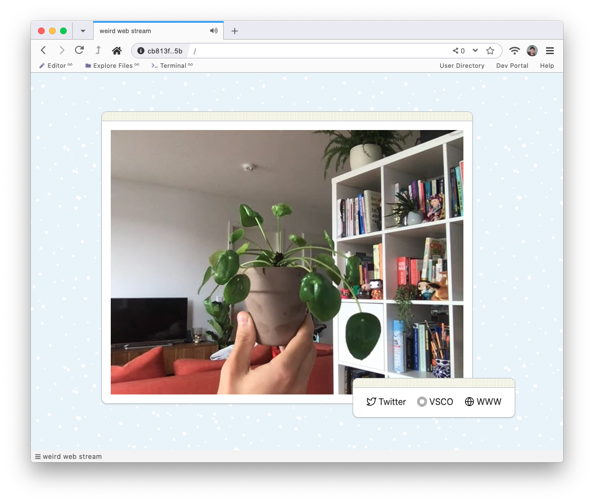

# hypercast custom template
This is a reasonably barebones custom template for [hypercast](https://github.com/Briix/hypercast), but shows the capabitilies of custom templates.



## Usage
```
git clone git://github.com/Briix/hypercast-custom-template.git
cd hypercast-custom-template

npm install
npm run build
```
This will place a `template.html` in the root of the project directory than can
then be used with [hypercast](https://github.com/Briix/hypercast)

## License
MIT
